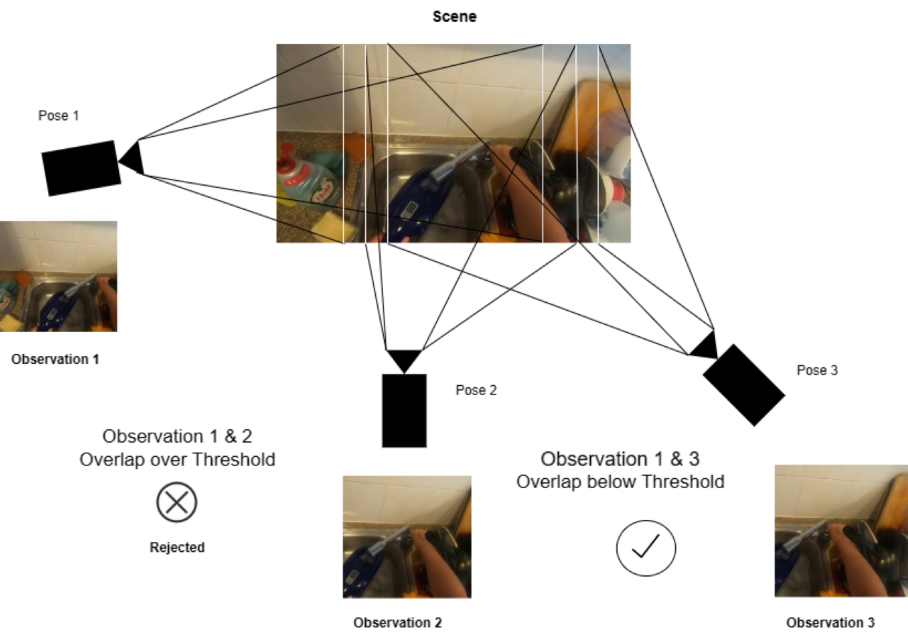

# Epic Filters

NeRF Data and Filters for the EPIC Kitchens Dataset

---

**Update**: This is an ongoing project. A fully processed minimal RGB frames dataset for NeRF training is coming soon.

## Resources

1. [JSON files from the EPIC Fields dataset](https://github.com/epic-kitchens/epic-Fields-code)
2. [Dataset from EPIC Kitchens](https://github.com/epic-kitchens/)

## Preprocessing (as of 2023, using Python 3.10)

1. Download the EPIC Kitchens dataset RGB frames and the Epic Fields JSON Data.
2. Copy and Paste this code to the Terminal in your preferred directory and run: 
    ```
    git clone https://github.com/1ssb/epic-filters && cd epic-filters && shopt -s extglob && rm -rf !(filters)
    ```
3. Configure the unzipper code with the target directory and run it as `python unzipper.py`
4. Install Libraries: 
    ```
    pip install Ultralytics cv2 opencv-python Pillow tqdm
    ```
5. Run the overlap filter first, followed by the dark filter, then the hands filter, and finally the fit filter (configure before running and check if necessary) using `python {filter_name}.py`

> **Note**: It is recommended to use a CUDA-enabled GPU (Tested on an RTX 4090) for the overlap filter. If you prefer to use the CPU, you can modify the code. It is advisable to use concurrency-based Lock methods for transformations in the Overlap filter.

## Usage

### Hands Filter

**Motivation**: This filter focuses on selecting images with human hands while minimizing occlusion of the environment. It employs the ultralytics YOLOv8 object detection model to detect persons in images and calculate the bounding box area ratio. Images with ratios below a certain threshold are copied to a destination folder.

**Description**: The filter consists of two main functions: "person area ratio" and "main." The former calculates the bounding box area ratio of detected persons, while the latter applies this calculation to filter images. The code can be adapted for other filtering criteria or detection models.

### Frustrum Overlap Filter



#### Overview
Calculates overlap between pairs of 3D camera frustums using JSON files. Optimized for parallel execution.

#### Dependencies
- `os`, `json`, `numpy`, `scipy`, `tqdm`, `collections`, `concurrent.futures`

#### Key Functions
- `calculate_frustum_overlap(frustum1, frustum2, K)`: Computes overlap ratio between two frustums.
- `calculate_frustum(pose, K, camera, n, f)`: Calculates frustum corners in world coordinates.
- `select_frame_pairs(file_path, min_overlap, max_overlap)`: Filters frame pairs based on overlap.
- `process_json_file(file_name)`: Processes each JSON file and writes frame pairs to a new JSON file.

#### Execution Flow
1. Set directories for JSON data and frame pairs.
2. Parallelize `process_json_file` using `ThreadPoolExecutor`.
3. Calculate and filter frame pairs in `select_frame_pairs`.
4. Write frame pairs to new JSON files.


### Post Processing

**Dark Filter**: This code removes dark images from a specified directory based on a given threshold value.

**Fit**: This code resizes and center-crops images in a specified directory using the PIL library.

For more details, please refer to the [Filter Code Documentation](https://github.com/1ssb/epic-filters/blob/main/Filter_Code_Documentation.pdf).

## Cite as

```bibtex
@misc{epic-filters, title={Epic Kitchen Filters}, author={Subhransu S. Bhattacharjee}, year={2023}, howpublished={https://github.com/1ssb/epic-filters/}}
```
© 2023 Subhransu S. Bhattacharjee. This work is protected under the MIT License.
